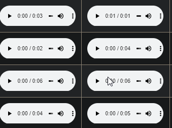

# [Pause-other-audios browser extension](https://github.com/FarisHijazi/pause-other-audios-browser-extension)

A browser extension to pause any other audio element once you click on a new one.

Tired of waiting for the previous audio to finish playing until you can play the next one?

No more overlapping audios!

---

## Installation

Currently only Google Chrome is supported

### Option 1: Install from Chrome Web Store

[Install extension from Chrome Web Store](https://chrome.google.com/webstore/detail/pause-other-audios/nbejhkdpgcfobedijbgomomlpekklhhd)

### Option 2: Download as development extension

Follow [this guide](https://webkul.com/blog/how-to-install-the-unpacked-extension-in-chrome/).

Summary:

1. Download and unzip this repository (see the "Code" button on top)
2. extract the zip file
3. Go to chrome extensions and enable "developer mode"
4. Click "load unpacked" > choose this folder
5. Done

### Option 3: Install using [GitHub releases](https://github.com/FarisHijazi/pause-other-audios-browser-extension/releases)

(Experimental, may not work)

Download the latest .crx release [here](https://github.com/FarisHijazi/pause-other-audios-browser-extension/releases/download/v1.0/pause-other-audios.crx) and open it with Chrome (rightclick open with ...)

